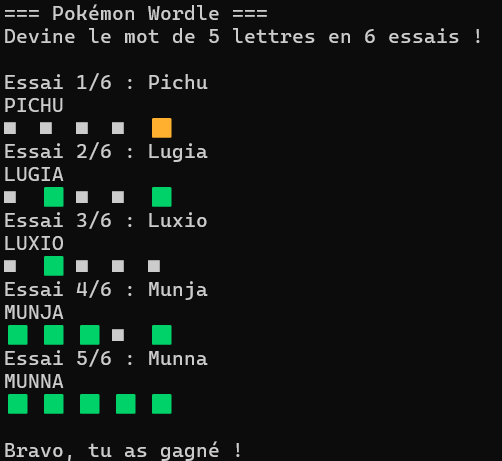
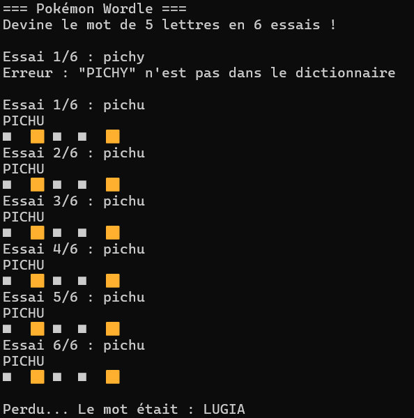
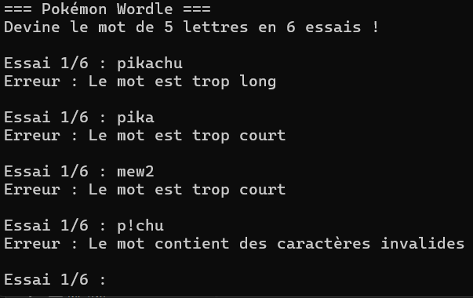

# Pokédle ( Pokémon + Wordle )

Projet Wordle en TDD / DDD avec TypeScript et Vitest.

## Règles du jeu

Le système choisit un pokémon secret de 5 lettres. Le joueur a 6 tentatives pour le deviner.

Après chaque tentative, chaque lettre reçoit un état :  
🟩 CORRECT : bonne lettre, bonne place  
🟨 MISPLACED : la lettre est dans le mot mais ailleurs  
⬛ ABSENT: la lettre n'est pas dans le mot

Règle spéciale (lettres multiples) : si une lettre apparaît plusieurs fois dans la proposition mais moins de fois dans le pokémon secret, elle ne peut être CORRECT ou MISPLACED qu'à concurrence de son nombre d'occurrences dans le secret. Les occurrences en trop sont marquées ABSENT.

## Architecture

- `src/wordle.ts` — Logique du jeu pure
- `src/type.ts` — Types du jeu
- `src/error.ts` — Les erreurs du jeu
- `src/local-dictionary.ts` — Dictionnaire avec les pokémons dedans (fichier JSON)
- `src/index.ts` — CLI pour jouer
- `src/wordle.test.ts` — Les tests unitaires

Le domaine est isolé de toute dépendance technique. Le dictionnaire utilise une interface `Dictionary`, donc dans les tests on peut mettre un stub à la place.

## Prérequis

- Node.js
- npm

## Installation

```bash
npm install
```

## Lancer les tests

```bash
npm run test:run
```

Les tests sont écrits en Given / When / Then et utilisent un stub du dictionnaire pour garantir le déterminisme.

## Jouer

```bash
npm start
```

Saisis tes propositions directement dans le terminal. Le jeu affiche le feedback après chaque tentative et gère la victoire / défaite.

## Screen du jeux

### Victoire


### Défaite


### Erreur


## Démarche

Le projet a été développé en Test First : écriture des tests décrivant un comportement métier, puis implémentation du code minimal pour les faire passer.
